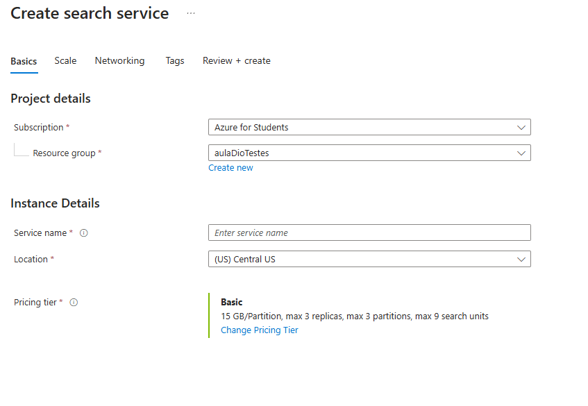
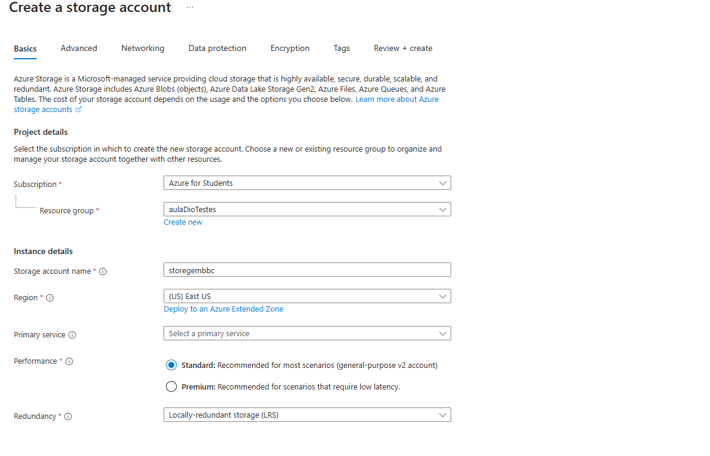
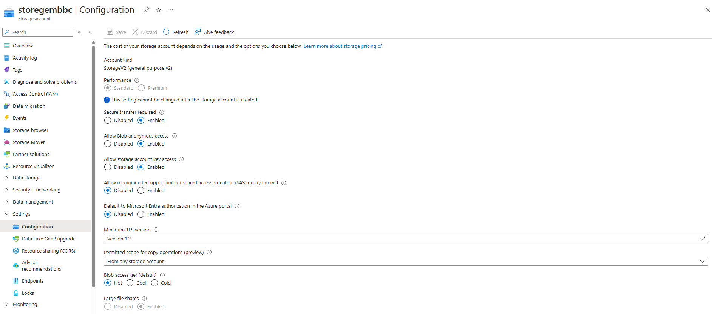
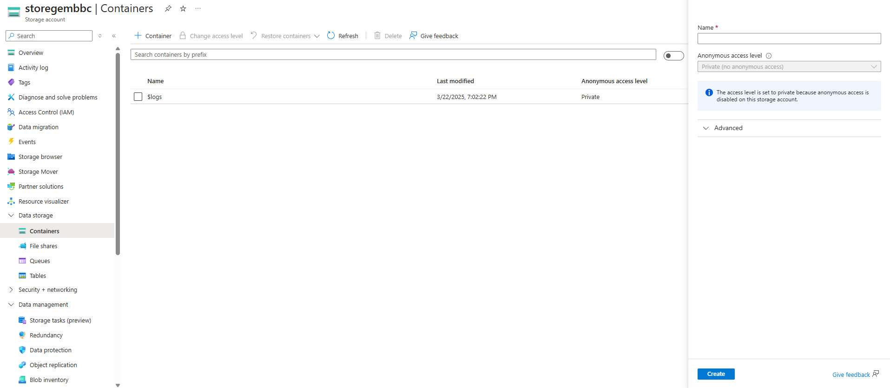

# Azure Cognitive Search: Utilizando AI Search para indexação e consulta de Dados

Este guia apresenta um passo a passo para configurar e utilizar o Azure AI Search para mineração de conhecimento e busca de insights em dados.

## Recursos Necessários

Para seguir este tutorial, serão necessários os seguintes recursos no Azure:

- **Azure AnI Search**: Gerencia idexação e consultas.
- **Azure AI Services**: Fornece serviços de IA para enriquecer os dados.
- **Storage Account**: Armazena documentos e dados brutos.

> **Importante**: O Azure AI Search e o Azure AI Services devem estar na mesma localização.

## Passos para Configuração

### 1. Criar um Recurso Azure AI Search
1. Acesse o [Portal Azure](https://portal.azure.com/).
2. Clique em **+ Criar um recurso** e procure por **Azure AI Search**.
3. Configure com:
   - Grupo de Recursos: Criar ou selecionar um existente.
   - Nome do Serviço: Um nome único.
   - Localização: Escolha uma região disponível.
   - Camada de Preço: **Básico**.
4. Clique em **Criar** e aguarde a implantação.

### 2. Criar um Recurso Azure AI Services
1. No portal do Azure, clique em **+ Criar um recurso** e procure por **Azure AI Services**.
2. Configure com:
   - Grupo de Recursos: Mesmo do Azure AI Search.
   - Localização: Mesmo do Azure AI Search.
   - Nome: Um nome único.
   - Camada de Preço: **Standard S0**.
3. Clique em **Criar** e aguarde a implantação.

### 3. Criar uma Conta de Armazenamento
1. No portal do Azure, clique em **+ Criar um recurso** e procure por **Conta de Armazenamento**.
2. Configure com:
   - Grupo de Recursos: Mesmo do Azure AI Search e AI Services.
   - Nome: Um nome único.
   - Localização: Escolha uma localização disponível.
   - Redundância: **Locally Redundant Storage (LRS)**.
3. Clique em **Criar** e aguarde a implantação.
4. No recurso criado, ative **Allow Blob anonymous access**.

### 4. Configurar o storege

### 5. Upload de Documentos para o Armazenamento
1. No recurso de Armazenamento, acesse **Containers** e crie um container chamado `coffee-reviews`.
2. Baixe os arquivos de exemplo de [neste link](https://aka.ms/mslearn-coffee-reviews).
3. Faça upload dos arquivos extraídos para o container.

### 6. Indexação dos Documentos
1. No recurso **Azure AI Search**, clique em **Import Data**.
2. Selecione **Azure Blob Storage** e preencha:
   - Nome da Fonte de Dados: `coffee-customer-data`.
   - Tipo de Extração: **Content and metadata**.
   - Selecione seu container `coffee-reviews`.
3. Adicione habilidades de IA:
   - Selecione seu recurso Azure AI Services.
   - Habilite **OCR** e **extração de localização, sentimentos e tags**.
   - Salve em um Knowledge Store.
4. Configure o indexador:
   - Nome do índice: `coffee-index`.
   - Marque campos como **filterable**.
   - Nome do indexador: `coffee-indexer`.
   - Agendamento: **Uma vez**.
5. Submeta e aguarde a indexação.
